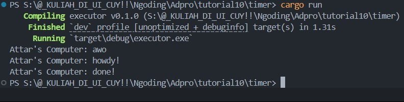
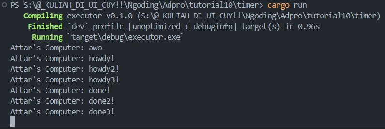

    <h1>MODULE 10 - TIMER</h1>

    

    <h2>Alwie Attar Elfandra</h2>
    <h2>2306241726</h2>

__1.2 Understanding how it works__

    

Berdasarkan hasil outputnya, dapat dipahami bahwa fungsi async yang dijalankan menggunakan executor akan dieksekusi **secara asinkron** dan **dijadwalkan terpisah dari alur utama program (`main`)**.

Pada program ini, perintah `println!("Attar's Computer: awo");` berada di luar future dan dieksekusi secara langsung di `main()`. Sementara itu, blok async yang berisi `"howdy!"` dan `"done!"` hanya akan dijalankan ketika future-nya dipoll oleh executor melalui `executor.run()`.

Akibatnya, urutan output menjadi:

1. `"awo"` dicetak dulu karena merupakan kode sinkron biasa.
2. Setelah executor mulai berjalan, task async dijalankan:

   * Mencetak `"howdy!"`
   * Menunggu `TimerFuture`, yang membuat task tertunda selama 2 detik.
3. Setelah timer selesai, task dibangunkan dan dilanjutkan, lalu mencetak `"done!"`.

Ini mencerminkan bagaimana mekanisme asynchronous Rust bekerja: future tidak langsung dieksekusi, melainkan dipoll oleh executor, dan executor akan mengatur lifecycle dari setiap future.

__1.3: Multiple Spawn and removing drop__

    

* Tugas-tugas asynchronous dikemas sebagai future dan disusun ke dalam queue oleh `Spawner`.
* `Executor` memproses future satu per satu, dan jika future belum selesai (`Pending`), ia ditaruh kembali untuk diproses ulang saat dibangunkan (`wake()`).
* Karena semua future menggunakan `TimerFuture` yang sama durasinya, maka hasil akhir terlihat berurutan dari awal (`howdy...`) dan akhir (`done...`), tapi semua `await` tidak menghalangi eksekusi tugas lain.
* Tanpa `drop(spawner)`, executor akan menunggu di kanal, menganggap masih ada kemungkinan task baru. Walaupun aman di contoh ini, hal ini **bisa memicu deadlock atau hang** di sistem nyata.